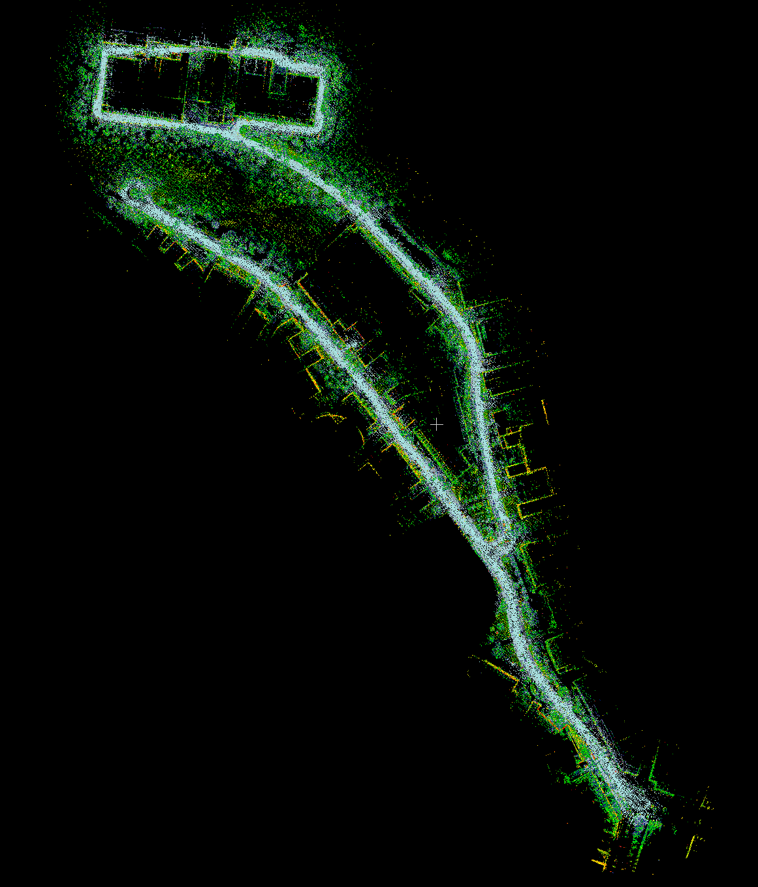

----------------------------------
# OPEN-KTH: An open Lidar dataset of KTH campus Valhallavägen

### Open-KTH is a subproject of the AD-EYE testbed for Automated Driving and Intelligent Transportation Systems.
### Learn more at https://www.adeye.se/open-kth or contact adeye@md.kth.se

-----------------------------------

The AD-EYE simulation platform is based on the description presented in the work :

Naveen Mohan, Martin Törngren, "AD-EYE: A Co-Simulation Platform for Early Verification of Functional Safety Concepts", SAE Technical Paper 19AE-0203/2019-01-0126, https://doi.org/10.4271/2019-01-0126

Preprint available at: https://arxiv.org/abs/1912.00448


Data collected by students of the group "AD-EYE on Road" in the capstone course of the Mechatronics Masters program using the AD-EYE platform. 

Mapping using the collected data was performed by Maxime Sainte Catherine from the AD-EYE team. 

<p align="center">

</p>

-----------------------------------
## PCD/LAS Map of KTH campus Valhallavägen


The commands `bash extract_pcd_map.bash` and `bash extract_las_map.bash` respectively extract the pcd and the las files.


## Rosbags used for the mapping

The data was collected under the form of rosbags using a Velodyne VLP-16 Lidar and a Xsens MTi-700 IMU sensor. Those sensors were mounted on a Renault Twizy which was driven around the KTH campus.


Running the command 

```bash extract_rosbags.bash```

in a terminal will extract the rosbag files.


## How the map was created

The ROS package `ndt_mapping` was used to generate the pcd map using the following settings:

| Setting | Value |
| -- | -- |
|resolution | 1.0|
|step_size | 0.1|
|trans_epsilon | 0.01|
|max_iterations | 50|
|leaf_size | 2.0|
|min_scan_range | 1.5|
|max_scan_range | 75.0|
|min_add_scan_shift | 2.0|
| /approximate_ndt_mapping/imu_topic | /imu/data |
| /approximate_ndt_mapping/imu_upside_down | True
| /approximate_ndt_mapping/incremental_voxel_update | True
| /approximate_ndt_mapping/method_type | False |
| /approximate_ndt_mapping/use_imu | True |
| /approximate_ndt_mapping/use_odom | False |


